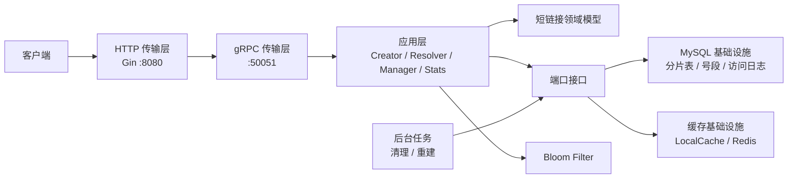

# ShortLink

> 一个基于 Go、Gin、gRPC、MySQL 与 Redis 构建的高性能短链接服务，支持短链生成、跳转、过期、软删除、访问统计与缓存抗压。

[](https://github.com/lucky798213/shortLink/actions/workflows/ci.yml)


## 项目介绍

ShortLink 是一个分层实现的短链接系统，用于把长 URL 转换成固定 6 位 Base62 短码，并提供 HTTP API、短链跳转、访问统计和后台维护能力。

这个项目解决的核心问题是：在高并发访问下，短链接系统既要快速完成重定向，又要保证短码唯一、数据可追踪、过期和删除状态准确，同时避免缓存穿透、热点回源和访问日志写入拖慢主链路。

主要特性：

- 固定 6 位 Base62 短码，字符集为 `0-9a-zA-Z`，基于唯一 ID 生成，稳定可复现。
- Gin Web 网关 + gRPC RPC 服务分层，HTTP 层负责协议适配，RPC 层负责核心业务和数据访问。
- MySQL 持久化存储，支持短链接分片表、软删除、过期清理和访问日志表。
- Redis 远程缓存 + 本地进程缓存 + `singleflight` 并发回源合并，降低数据库压力。
- Redis Bloom Filter 拦截大概率不存在的短码，缓解缓存穿透。
- 异步访问日志写入，跳转请求无需等待统计数据落库。
- Redis/内存令牌桶限流、Hystrix 熔断、健康检查、etcd 服务发现和 nginx 入口示例。
- 提供 Docker Compose 一键启动 MySQL、Redis、etcd、RPC、Web 与 nginx。

## 快速开始

### 前置依赖

- Go `1.24+`
- Docker 与 Docker Compose
- Git
- 可选：`curl`、`jq`，用于命令行调试接口

> Protobuf 契约位于 `api/shortlink/v1/shortlink.proto`，Go 代码由 Buf 和官方插件生成。普通构建不依赖生成工具；修改协议后执行 `buf lint && buf generate`。

### 方式一：使用 Docker Compose 启动

```bash
git clone git@github.com:lucky798213/shortLink.git
cd shortLink

docker compose up --build -d
```

启动后检查服务状态：

```bash
curl http://localhost:8080/healthz
curl http://localhost:8080/readyz
```

默认端口：

| 服务 | 地址 | 说明 |
|---|---|---|
| Web API | `http://localhost:8080` | Gin HTTP 服务 |
| nginx | `http://localhost:8888` | nginx 反向代理入口 |
| RPC | `localhost:15051` | gRPC 服务映射端口 |
| MySQL | `localhost:3306` | 默认库名 `short_url` |
| Redis | `localhost:6379` | 缓存与限流 |
| etcd | `localhost:2379` | 服务发现 |

停止服务：

```bash
docker compose down
```

如需同时删除容器数据：

```bash
docker compose down -v
```

### 方式二：本地开发运行

先启动依赖服务：

```bash
docker compose up -d mysql redis etcd
```

启动 RPC 服务：

```bash
go run ./cmd/rpc
```

另开一个终端启动 Web 服务：

```bash
go run ./cmd/web
```

常用校验命令：

```bash
go test ./...
go vet ./...
go build ./...
```

## 使用示例

### 创建短链接

```bash
curl -X POST http://localhost:8080/api/short-links \
  -H 'Content-Type: application/json' \
  -d '{"origin_url":"https://example.com/articles/a-very-long-url","expire_at":0}'
```

示例响应：

```json
{
  "short_code": "000001",
  "short_url": "http://localhost:8080/000001",
  "origin_url": "https://example.com/articles/a-very-long-url",
  "expire_at": 0
}
```

`expire_at` 为 Unix 秒级时间戳，传 `0` 表示不过期。

### 访问短链接

```bash
curl -I http://localhost:8080/000001
```

短码存在且未过期时返回 `301`，并通过 `Location` 跳转到原始 URL。短码不存在返回 `404`，已过期返回 `410`。

### 查询短链接详情

```bash
curl http://localhost:8080/api/short-links/000001
```

### 查询访问统计

```bash
curl http://localhost:8080/api/short-links/000001/stats
```

统计接口返回 PV、UV、最近访问时间、Referer 排名和 User-Agent 排名。

### 删除短链接

```bash
curl -X DELETE http://localhost:8080/api/short-links/000001
```

删除成功返回 `204 No Content`。这里使用软删除，数据仍保留在数据库中，但短链不再可访问。

## API 概览

| 方法 | 路径 | 功能 |
|---|---|---|
| `POST` | `/api/short-links` | 创建短链接 |
| `GET` | `/api/short-links/:code` | 查询短链接详情 |
| `GET` | `/api/short-links/:code/stats` | 查询访问统计 |
| `DELETE` | `/api/short-links/:code` | 软删除短链接 |
| `GET` | `/:code` | 跳转到原始 URL |
| `GET` | `/healthz` | Web 服务存活检查 |
| `GET` | `/readyz` | Web + RPC 就绪检查 |

## 项目目录

```text
.
├── api/shortlink/v1/       # 版本化 Protobuf 契约与生成代码
├── cmd/
│   ├── rpc/                # RPC 进程入口，只负责装配和生命周期
│   └── web/                # Web 进程入口，只负责装配和生命周期
├── configs/                # RPC 与 Web 的类型化 YAML 配置
├── internal/
│   ├── config/             # 配置加载、默认值、环境变量覆盖与校验
│   ├── shortlink/          # 领域模型、校验、短码算法
│   │   └── app/            # Creator/Resolver/Manager/Stats 应用用例与端口
│   ├── transport/          # gRPC 与 HTTP 协议适配器
│   ├── infra/              # MySQL 分片存储、ID 号段、Redis/本地缓存
│   ├── jobs/               # 过期清理与 Bloom Filter 重建
│   └── platform/           # Bloom、etcd、日志、限流等平台能力
├── scripts/
│   ├── mysql/              # 初始化 SQL 与迁移脚本
│   └── wrk/                # 压测脚本
├── docs/                   # 开发计划、压测报告、面试问答与运行手册
├── nginx/                  # nginx 反向代理配置
├── .github/workflows/      # GitHub Actions CI
├── Dockerfile.rpc          # RPC 服务镜像构建
├── Dockerfile.web          # Web 服务镜像构建
└── docker-compose.yaml     # 本地完整环境编排
```

## 架构分层



依赖方向固定为“传输层 → 应用层 → 领域层”，MySQL、Redis 等实现通过应用层端口反向接入。HTTP 层不访问数据库，领域层也不知道 GORM、Redis 或 protobuf。

## 配置说明

配置由 `internal/config` 一次性解析到强类型结构体，并在启动前完成必填项校验。默认文件为 `configs/rpc.yaml` 和 `configs/web.yaml`；环境变量仍以大写下划线形式覆盖，例如 `DB_DSN`、`GRPC_ADDR`、`REDIS_ADDR`。

需要使用其他配置文件时，分别设置 `SHORT_URL_RPC_CONFIG` 或 `SHORT_URL_WEB_CONFIG`。Docker 镜像把两份默认配置复制到 `/etc/short_url/rpc.yaml` 和 `/etc/short_url/web.yaml`。

## 压测结果

正式压测记录见 [docs/load-test-report-2026-06-04-formal.md](docs/load-test-report-2026-06-04-formal.md)。

在本地 Docker Compose 完整环境中，通过 Docker cgroup 模拟 2C2G 服务端资源，60 秒端到端压测结果为：

| 链路 | 目标压力 | 成功率 | 实际 QPS | p99 |
|---|---:|---:|---:|---:|
| 跳转 `GET /:code` | 12,000 QPS | 100% | 12,004.63 | 41.013ms |
| 创建 `POST /api/short-links` | 800 QPS | 100% | 803.53 | 71.425ms |

## 开发命令

```bash
go build ./...
go test ./...
go test -race ./...
go test ./internal/shortlink/code/... -v
go vet ./...
buf lint
buf generate
```
